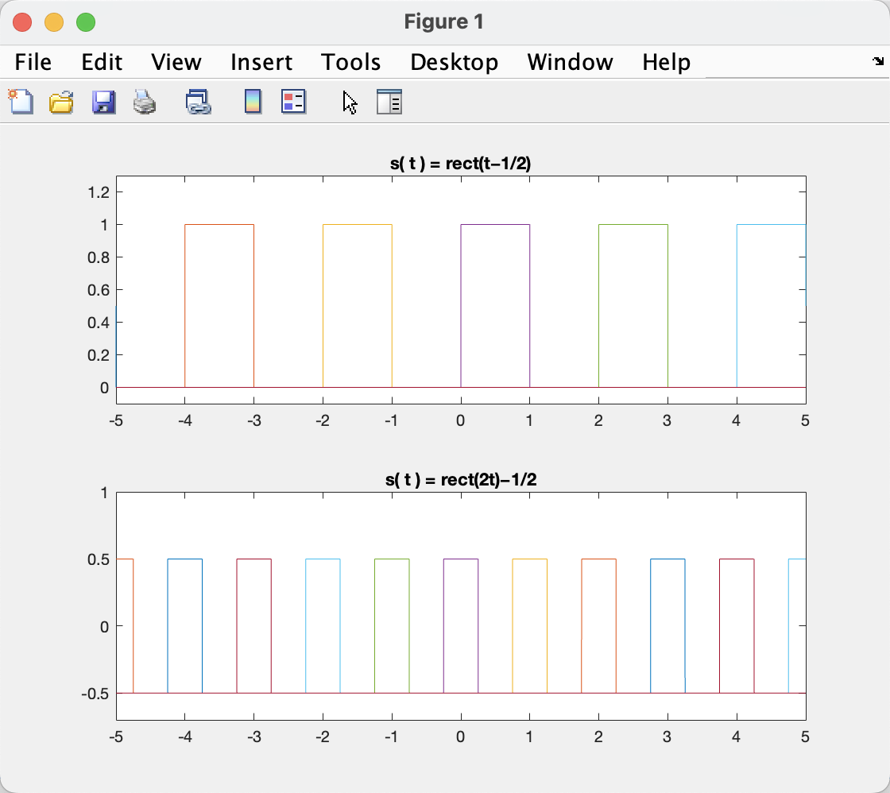
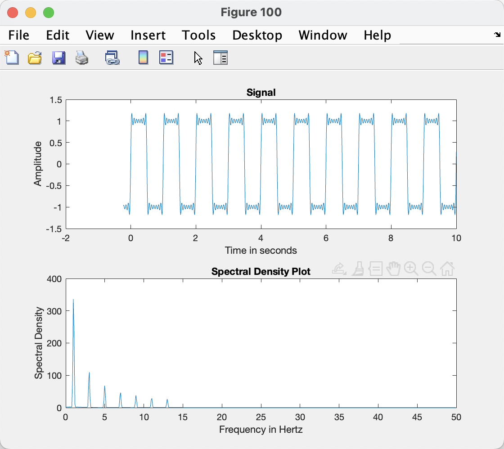
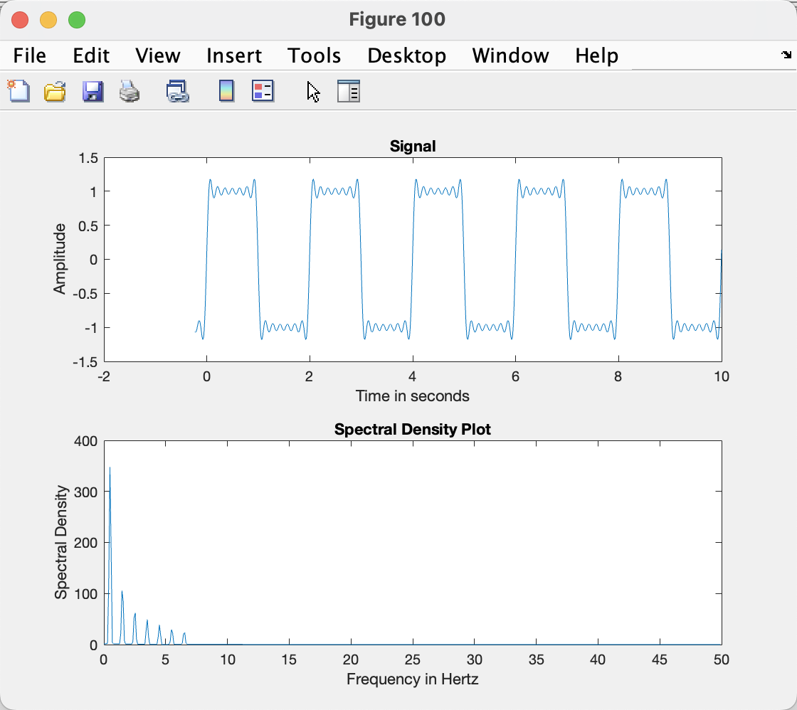
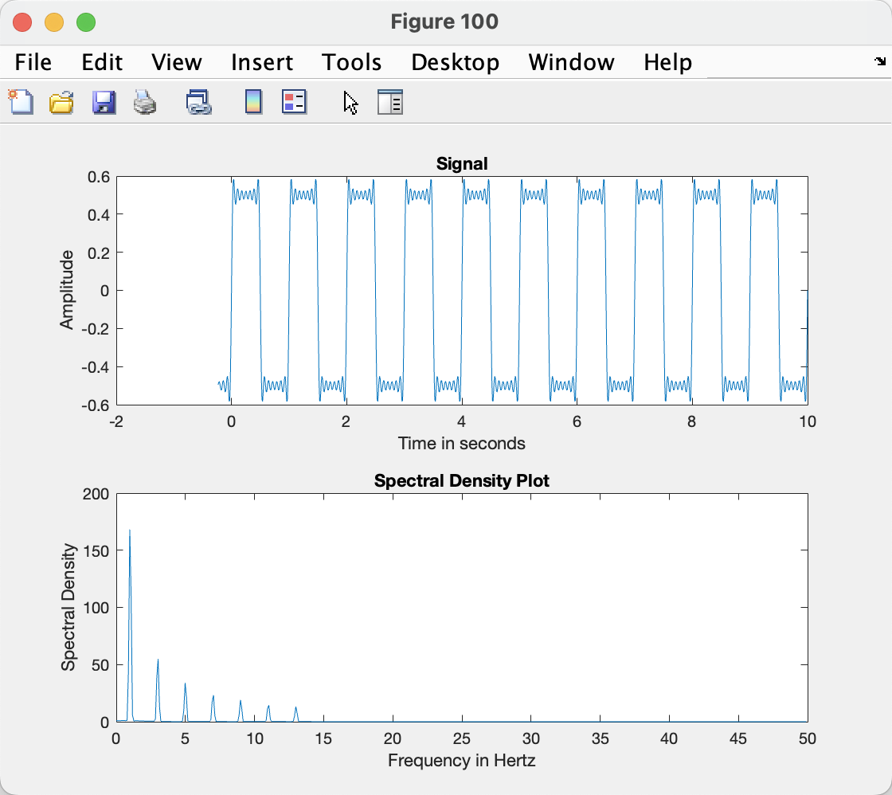
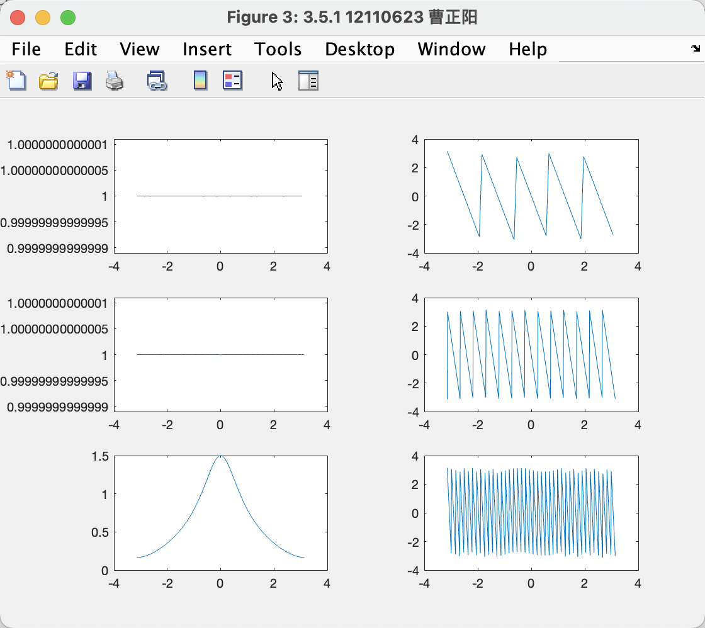

#12110623 曹正阳

## 3.2
> Compute the Fourier series expansion in the form


>  Sketch the signal on the interval [0, 𝑇0].
> no, i sketch it on all the time


## 3.4.1
> first


>sec


>thir


there exist Gibbs phenomenon that is the oscillatory in the signal.

And spectal density is some impulse train with different amptitude, because the results signal is made of all kind of sin singal, whose F.T. is impusle. So the spectrium is the sum of these impulse. 

## 3.4.2
> Triangular pulse duration of 1 sec; period of 2 sec; modulating frequency of 10 Hz


> Triangular pulse duration of 1 sec; period of 2 sec; modulating frequency of 15 Hz


> Triangular pulse duration of 1 sec; period of 3 sec; modulating frequency of 10 Hz


>Triangular pulse duration of 1 sec; period of 6 sec; modulating frequency of 10 Hz


####  1) What effect does changing the modulating frequency have on the spectral density?
Since F.T. of sin function is a symmertric impulse, and the product of time correspond the convolution of freq. So we shift the signal by producting a sin function.

SO changing the modulating frequency change the central frequency of the plot.

#### 2) Why does the spectrum have a comb structure and what is the spectral distance between impulses?

> for comb structure
  
The F.T. of triangular pulse is $\triangle(\frac{t}{\tau}) \hArr [\frac{\tau}{2} sinc^2(\frac{\omega\tau}{4})]$

The shape of $sinc^2$ is a comb, thats the reason why.

> for distance
  
$f = 1/T$
So for period 2, the frequency between each impylses is 0.5 Hz

#### 3) What would happen to the spectral density if the period of the triangle pulse were to increase toward infinity? (in the limit)

 the Fourier transform of a periodic signal is an impulse train where the impulse amplitudes are 2𝜋 times the Fourier coefficients of that signal.

the coefficients is defined as: $X_s(k) = \frac{1}{T} \int x_T(t)e^{-ik\omega_0t}dt$ and $\omega = \frac{2\pi}{T}$

so the bigger the period T, the smaller the coeddicients and small $\omega$, the value of result will limit to zero and the distance between each impulse will limit to zero too.

## 3.5



```Matlab
% hello lab3
%% 3.1 BACKGROUND EXERCISES
%plot two period signal
syms t
n=-10:10;
subplot(211)
fplot(rectangularPulse(t-(n*4+1)/2),[-5 5])
ylim([-0.1 1.3])
title("s( t ) = rect(t−1/2)")
subplot(212)
fplot((rectangularPulse(2*(t+n))-1/2),[-5 5])
ylim([-0.7 1])
title("s( t ) = rect(2t)−1/2")

%% 3.5 DT FREQUENCY ANALYSIS
% 3.5.1
figure("Name","3.5.1 12110623 曹正阳")

x=[0 0 0 0 1 0 0 0 0];
n=[-4 -3 -2 -1 0 1 2 3 4];
DW = 0.1;
dude = DTFT(x,1,DW);
l = -pi:DW:pi;
subplot(321)
plot(l,abs(dude))
subplot(322)
plot(l,angle(dude))

x=[0 0 0 0 0 0 1 0 0 0];
n=[-1 0 1 2 3 4 5 6 7 8 9 10];
DW = 0.01;
buddy = DTFT(x,7,DW);
l = -pi:DW:pi;
subplot(323)
plot(l,abs(buddy))
subplot(324)
plot(l,angle(buddy))

n=-20:20;
x=(0.5).^n.*heaviside(n);
DW = 0.01;
honey = DTFT(x,21,DW);
l = -pi:DW:pi;
subplot(325)
plot(l,abs(honey))
subplot(326)
plot(l,angle(honey))
% 
% figure("Name","3.5.1 12110623 曹正阳")
% w=-100:100;
% 
% bob = 1./(1-0.5*exp(-sqrt(-1)*w));
% plot(w,abs(bob))

function y=DTFT(x,n0,dw)
    w = -1*pi:dw:pi;
    i = sqrt(-1);
    
    y = 0;
    for n=n0:length(x)
        y = y + x(n)*exp(-i*w*(n+n0-1));
    end
end
```


thx for watching