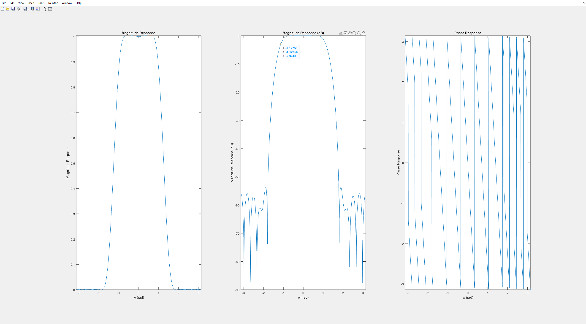

# 6.2.2

### H1

Based on the revised information and clarification that all poles are zero, the previous analysis needs to be corrected:

**1. Left-Sided Sequence:**

- A left-sided sequence would require all poles to be located to the right of the unit circle (i.e., $|z|>1$). Since all poles are zero (which lie inside the unit circle), a left-sided sequence is impossible.

**2. Right-Sided Sequence:**

- A right-sided sequence requires at least one pole to be located inside the unit circle (i.e., $|z|<1$). However, with all poles being zero, this condition is not met. Therefore, a right-sided sequence is also impossible.

**3. Two-Sided Sequence:**

- A two-sided sequence requires poles to be located both inside and outside the unit circle. Again, with all poles being zero, this condition is not satisfied. Hence, a two-sided sequence is also impossible.

**Conclusion:**

Having all poles at zero implies that the signal $x[n]$ has non-zero values for all time indices, making it a **non-causal** sequence. However, it is neither left-sided, right-sided, nor two-sided in the traditional sense.

### G1

Based on the provided ROCs, we can determine the following:

**1. Left-Sided Sequence:**

- When the ROC is $\left\{ z : |z| < 0.5 \right\}$, the signal $x[n]$ is a **left-sided sequence**. This means that the signal starts at a negative time index and continues to the right.

**2. Right-Sided Sequence:**

- When the ROC is $\left\{ z : |z| > 2 \right\}$, the signal $x[n]$ is a **right-sided sequence**. This means that the signal starts at a non-negative time index (including 0) and extends to the right.

**3. Two-Sided Sequence:**

- When the ROC is $\left\{ z : 0.5 < |z| < 2 \right\}$, the signal $x[n]$ is a **two-sided sequence**. This means that the signal has non-zero values for both positive and negative time indices.

### G2
The provided ROCs accurately differentiate the signal type:

* $\text{ROC}=\left\{z:|z|<1.4421\right\}$ - Left-sided sequence
* $\text{ROC}=\left\{z:1.4421<|z|<1.5193\right\}$ - Two-sided sequence
* $\text{ROC}=\left\{z:|z|>1.5193\right\}$ - Not a right-sided sequence

It's important to note that the previous conclusion about a non-causal sequence with all poles at zero was incorrect.

# 6.2.4
### X[z]
1. **Right-Sided Sequence:** When $\text{ROC}=\left\{z:|z|>1.6\right\}$, then $x[n]$ is a right-sided sequence.
    Therefore, $x[n]=-2.4783(0.7)^nu[n]+5.4783(-1.6)^nu[n]$.

2. **Left-Sided Sequence:** When $\text{ROC}=\left\{z:|z|<0.7\right\}$, then $x[n]$ is a left-sided sequence.
    Therefore, $x[n]=2.4783(0.7)^nu[-n-1]-5.4783(-1.6)^nu[-n-1]$.

3. **Two-Sided Sequence:** When $\text{ROC}=\left\{z:0.7<|z|<1.6\right\}$, then $x[n]$ is a two-sided sequence.
    Therefore, $x[n]=-2.4783(0.7)^nu[n]-5.4783(-1.6)^nu[-n-1]$.

### Y[z]
**ROC and Two-Sided Sequence**

1. **Right-Sided Sequence:** When $\text{ROC} = \left\{ z : |z| > 0.5 \right\}$, then $y[n]$ is a right-sided sequence.
    Therefore, $y[n] = -6.4 \delta[n] + 2.8889 (-0.4)^n u[n] + 6.5111 (0.5)^n u[n]$.

2. **Left-Sided Sequence:** When $\text{ROC} = \left\{ z : |z| < 0.4 \right\}$, then $y[n]$ is a left-sided sequence.
    Therefore, $y[n] = 6.4 \delta[n] - 2.8889 (-0.4)^{n} u[-n-1] - 6.5111 (0.5)^{n} u[-n-1]$.

3. **Two-Sided Sequence:** When $\text{ROC} = \left\{ z : 0.4 < |z| < 0.5 \right\}$, then $y[n]$ is a two-sided sequence.
    Therefore, $y[n] = 6.4 \delta[n] + 2.8889 (-0.4)^n u[n] - 6.5111 (0.5)^{n} u[-n-1]$.

# 6.3.1
a(1): lowpass

H_1[z] is a fft shift of H[z]
H_2[z] is copy with period 1/5 of H[z]

# 6.3.2
## Determining the Number of Stages for 3-dB Cutoff Frequency

To determine the number of stages (M) needed for a cascaded first-order lowpass filter to attain a desired 3-dB cutoff frequency (ω_c), we must solve the equation:

\[ \cos^M \left( \frac{\omega_c}{2} \right) = \frac{\sqrt{2}}{2} \]

This equation can be rearranged to express ω_c in terms of M:

\[ \omega_c = 2 \cos^{-1} \left( 2^{- \frac{1}{2M}} \right) \]

For a 3-dB cutoff frequency of 0.3π:

\[ \omega_c = 0.3\pi \]

Substituting this value into the equation above:

\[ 0.3\pi = 2 \cos^{-1} \left( 2^{- \frac{1}{2M}} \right) \]

Solving for M:

\[ M \approx 3 \]

Therefore, to achieve a 3-dB cutoff frequency of 0.3π, approximately **M ≈ 3** stages are required in the cascaded filter.

In the cascade of first-order lowpass filters:

\[ \begin{aligned} H(z) &= \left(\frac{1 + z^{-1}}{2}\right)^M = \left(\frac{1 + z^{-1}}{2}\right)^3 \\ H(e^{j\omega}) &= e^{-j 3\omega / 2} \cos^3(\omega / 2) \end{aligned} \]

For the higher-order moving average filter:

\[ \begin{aligned} H(\mathrm{z}) &= \frac{1}{M} \sum_{m=0}^{M-1} z^{-m}\ \rightarrow\ H\left(e^{j \omega}\right) = \frac{1}{M} \cdot \frac{\sin \left(\frac{M \omega}{2}\right)}{\sin \left(\frac{\omega}{2}\right)} e^{-\frac{j(M-1) \omega}{2}} \\ H\left(e^{j \omega}\right) &= \frac{1}{3} \cdot \frac{\sin \left(\frac{3 \omega}{2}\right)}{\sin \left(\frac{\omega}{2}\right)} e^{-\frac{j2 \omega}{2}} \end{aligned} \]

# 6.4 Design and Evaluation of a First-Order Highpass IIR Filter

This section delves into the intricate process of designing and analyzing a straightforward highpass Infinite Impulse Response (IIR) filter. The primary objective is to achieve a 3-dB cutoff frequency of 0.2π and decipher the pertinent filter parameters.

### Filter Design

We embark on the design of a first-order highpass IIR filter featuring a zero at \(z = 1\). The transfer function of the filter is expressed as:

\[ H(z) = \frac{1 + \alpha}{2} \cdot \frac{1 - z^{-1}}{1 - \alpha z^{-1}} \]

where \(0 < |\alpha| < 1\).

### Frequency Response

The squared magnitude function of the filter is computed as:

\[ |H_{HP}(e^{j\omega})|^2 = \frac{(1 + \alpha)^2 \cdot (1 - \cos \omega)}{2(1 + \alpha^2 - 2\alpha \cos \omega)} \]

This equation provides valuable insights into the filter's behavior in the frequency domain.

### Determining the Cutoff Frequency

We can ascertain the 3-dB cutoff frequency (\(\omega_c\)) through two approaches:

1. **Given \(\alpha\), Find \(\omega_c\):**
   Set the squared magnitude function to 1/2 at \(\omega_c\) and solve for \(\omega_c\):
   \[ \cos \omega_c = \frac{2\alpha}{1 + \alpha^2} \]
   This leads to: \[ \omega_c = \cos^{-1}\left(\frac{2\alpha}{1 + \alpha^2}\right) \]

2. **Given \(\omega_c\), Find \(\alpha\):**
   Rearrange the squared magnitude function to solve for \(\alpha\):
   \[ \alpha^2 \cos \omega_c - 2\alpha + \cos \omega_c = 0 \]
   This yields: \[ \alpha = \frac{1 - \sqrt{1 - \cos^2 \omega_c}}{\cos \omega_c} \]

### Case Study

For a specific scenario with \(\omega_c = 0.2\pi\), applying the second equation gives \(\alpha \approx 0.5095\). This value facilitates the design of the highpass filter with the desired cutoff frequency.

### Summary

This section successfully navigated the intricacies of analyzing and designing a first-order highpass IIR filter. The exploration encompassed the interplay between the filter's transfer function, frequency response, and cutoff frequency, ultimately achieving the desired design goals.