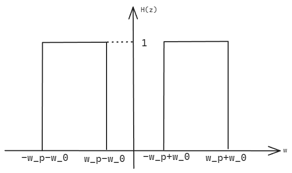

## SUSTech DSP tutorial 11

#### 12110623 曹正阳

## Q1 

$X(z)=\frac{7}{1+0.3z^{-1}-0.1z^{-2}}$ can be partial fraction into $X(z)=\frac{5}{1+0.5z^{-1}}+\frac{2}{1-0.2z^{-1}}$

so， the inverse z-transforms could be 
* $5*(-0.5)^{n} \mu[n] + 2*0.2^{n} \mu[n]$ $ ROC = \{z:|z|>0.5\}$
* $5*(-0.5)^{n} \mu[n] - 2*0.2^{n} \mu[n] $ $ROC = \{z:|z|>0.5\} \cap \{z:|z|<0.2\}$ don't exist
* $-5*(-0.5)^{n} \mu[n] + 2*0.2^{n} \mu[n] $ $ROC = \{z:0.2<|z|<0.5\}$ 
* $-5*(-0.5)^{n} \mu[n] - 2*0.2^{n} \mu[n] $ $ROC = \{z:|z|<0.2\}$ 

## Q2
Using long division
$X(z) = \frac{1}{1-z^{-3}} = 1+z^{-3}+z^{-6}+ \dots +z^{-3k} + \dots$
so, $x[n] = \sum_{k=0}^{\infty}\delta[n-3k]$

## Q3
let $X(z) = 1$, so the output of $H(z)$ is $H(z)$ itself,

$H_1(z) = 2.1 + 3.3z^{-1} + 0.7z^{-2}$
$H_2(z) = 1.4 - 5.2z^{-1} + 0.8z^{-2}$
$H_1(z) = 3.2 + 4.5z^{-1} + 0.9z^{-2}$

$H(z) = [H_1(z)+1]H_2(z)+H_1(z)H_3(z) = 11.06 + 8.51z^{-1} + 5.28z^{-2} + 5.12z^{-3} + 1.19z^{-4}$

## Q4
> For convenience, we call $H_{LP}(z)$ with $H(z)$ and $ G_1(z)$ with $ G(z)$

Frequency inversion in the Z-domain corresponds to a reflection of the frequency response about the unit circle. So, it is a right frequncy shift with $\pi$ of $H(z)$

Sketch:

So,$G(z)$is a highpass filter, the bandedge is from $\pi - \omega_s$ to $\pi - \omega_p$, the stopband ripple is $\delta_p$, the passband ripple is $\delta_s$

$$G(z) = H(-z) = \sum_{n=-\infty}^{\infty} h[n](-z)^{-n} = \sum_{n=-\infty}^{\infty} h[n](z)^{-n}(-1)^{-n} = \sum_{n=-\infty}^{\infty} h\left[n_{\text {even}}\right](z)^{-n_{\text {even}}} - \sum_{n=-\infty}^{\infty} h\left[n_{\text {odd}}\right](z)^{-n_{\text{odd}}}$$

so, $g[n] = (-1)^n h[n]$

## Q5

let $z = e^{j\omega}$, so we can analyse the magnitude response.
When $H(e^{j\omega}*e^{j\omega_0}) = H(e^{j(\omega + \omega_0)})$, there is a left frequncy shift with $\omega_0$ with $H(z)$

The Sketch of $H(e^{j\omega_0} z)$ is as follows:

$G(z)$ is two $H(z)$ shift two different side and add them together,so $g[n] = 2h[n]*cos(n\omega_0)$, since multiple with cos in time domain is frequency shift to tow sides. So the Sketch of $G(z)$ is as follows:

And the bandwith is $2\omega_p$

## Q6

To make the output \( y[n] \) a delayed and scaled replica of the input \( x[n] \) in a discrete-time system with the transfer function \( H_0(z) = 1 + \alpha z^{-1} \), you need to choose a feedback filter \( F_0(z) \).

The output \( y[n] \) is related to the input \( x[n] \) through the following equation:

\[ Y(z) = X(z) \cdot (H_0(z) \cdot F_0(z) - H_0(-z) \cdot F_0(-z) )\]

In this case, we want \( y[n] \) to be a delayed and scaled version of \( x[n] \), which means:

\[ Y(z) = c \cdot X(z) \cdot z^{-k} \]

where \( c \) is a scaling factor, and \( k \) is the delay.

Now, substitute \( Y(z) \) into the equation:

\[ c \cdot X(z) \cdot z^{-k} = X(z) \cdot (H_0(z) \cdot F_0(z) - H_0(-z) \cdot F_0(-z) )\]
\[ c \cdot z^{-k} = H_0(z) \cdot F_0(z) - H_0(-z) \cdot F_0(-z)\]

when $F_0(z) = H_0(z)$, the  $H_0(z) \cdot F_0(z) - H_0(-z) \cdot F_0(-z) = 4\alpha z^{-1}$ satisfy the $c \cdot z^{-k}$.

## Q7

take z-transform to Y :

$Y(z) = a_1z^{-(k+1)}X(z) + a_2z^{-k}X(z) + a_3z^{-(k-1)}X(z) + a_2z^{-(k-2)}X(z) + a_1z^{-(k-3)}X(z)$

So the transfer function is :

$H(z) = a_1z^{-(k+1)} + a_2z^{-k} + a_3z^{-(k-1)} + a_2z^{-(k-2)} + a_1z^{-(k-3)}$

find the frequency response \(H(e^{j\omega})\) by replacing \(z\) with \(e^{j\omega}\):

$H(e^{j\omega}) = a_1e^{-j(k+1)\omega} + a_2e^{-jk\omega} + a_3e^{-j(k-1)\omega} + a_2e^{-j(k-2)\omega} + a_1e^{-j(k-3)\omega}$

When $k=1$, the system is symmetric so all the imaginary part cancel out.