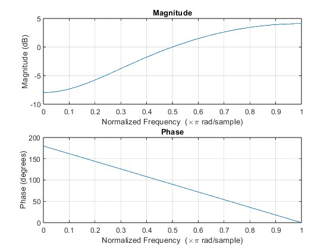

## SUSTech DSP tutorial6

#### 12110623 曹正阳

## Q1 
The frequency response of a system is the DTFT of impulse response.

$H[\omega] = DTFT(0.4^n\mu[n]) = \frac{1}{1-0.4e^{-j\omega}}$

$H[\pm\frac{\pi}{4}] = \frac{1}{1-0.4e^{\mp j\frac{\pi}{4}}} = \frac{1}{1-0.4(cos(\mp \frac{\pi}{4})+jsin(\mp\frac{\pi}{4}))} = \frac{1}{[1-0.4cos(\mp \frac{\pi}{4})]-0.4jsin(\mp\frac{\pi}{4})} = \frac{1}{[1-0.4cos(\mp \frac{\pi}{4})]^2+(0.4sin(\mp\frac{\pi}{4}))^2}(1-0.4cos(\mp \frac{\pi}{4})+0.4jsin(\mp\frac{\pi}{4})) = \frac{1}{[1-0.4cos(\frac{\pi}{4})]^2+(0.4sin(\frac{\pi}{4}))^2}(1-0.4cos(\frac{\pi}{4})\mp0.4jsin(\frac{\pi}{4})) = 1.6826(0.7171 \mp 0.2828) = 1.206 \mp 0.4759 = 1.2965e^{\mp 0.3756}$

## Q2
#### (a)
Suppose the $ h[4] = -h[0] = \alpha , h[3] = -h[1] = \beta , h[2] = \delta$. 
So $H[e^{j\omega}] = h[0] + h[1]e^{-j\omega} + h[2]e^{-2j\omega} + h[3]e^{-3j\omega} + h[4]e^{-4j\omega} = \alpha(1-e^{-4j\omega}) +\beta(e^{-j\omega}-e^{-3j\omega}) + \delta e^{-2j\omega} = \alpha(e^{2j\omega}-e^{-2j\omega})e^{-2j\omega} +\beta(e^{j\omega}-e^{-j\omega})e^{-2j\omega} + \delta e^{-2j\omega} = je^{-2j\omega} (2\alpha sin(2\omega) + 2\beta sin(\omega) + \delta)$

Because h[n] is anti-symmetric, so $ h[2] = \delta = 0$ 

Also $|H[e^{j\frac{\pi}{4}}]| = 0.5 $ and $|H[e^{j\frac{\pi}{2}}]| = 1 $


We can get $\alpha = -0.1036, \beta = 0.5$ 

#### (b)

$H[e^{j\omega}] = je^{-2j\omega} (−0.2072 sin(2\omega) +  sin(\omega))$


#### (c)


$\tau_p(\omega_0) = -\frac{\theta(\omega_0)}{\omega_0} = -\frac{\pi}{2\omega}+2$
$\tau_g(\omega_0) = -\frac{d\theta(\omega_0)}{d\omega_0} = 2$

## Q3

#### (a)
Suppose the $ h[3] = h[0] = \alpha , h[2] = h[1] = \beta$. 
So $H[e^{j\omega}] = h[0] + h[1]e^{-j\omega} + h[2]e^{-2j\omega} + h[3]e^{-3j\omega} = \alpha(1+e^{-3j\omega}) +\beta(e^{-j\omega}+e^{-2j\omega}) = \alpha(1+e^{-3j\omega}) +\beta(e^{-j\omega}+e^{-2j\omega}) = \alpha(e^{1.5j\omega}+e^{-1.5j\omega})e^{-1.5j\omega} +\beta(e^{0.5j\omega}+e^{-0.5j\omega})e^{-1.5j\omega} = e^{-1.5j\omega}[2\alpha cos(1.5\omega) +2\beta cos(0.5\omega)]$

Also $|H[e^{j\frac{\pi}{4}}]| = 1 $ and $|H[e^{j\frac{\pi}{2}}]| = 0.5 $

We can get $\alpha = -0.132689, \beta = 0.972484/2$ 


#### (b)

$H[e^{j\omega}] = e^{-1.5j\omega} (−0.265378 cos(1.5\omega) +  0.972484cos(0.5\omega))$

#### (c)
$\tau_p(\omega_0) = -\frac{\theta(\omega_0)}{\omega_0} = \frac{3}{2}$
$\tau_g(\omega_0) = -\frac{d\theta(\omega_0)}{d\omega_0} = \frac{3}{2}$

## Q4

#### (a)
$H_A[e^{j\omega}] = \frac{0.3 - e^{-j\omega} + 0.3e^{-2j\omega}}{1}$

```matlab
b = [0.3 -1 0.3];
a = [1];
freqz(b, a, 1024);
```



$H_B[e^{j\omega}] = \frac{0.3 + e^{-j\omega} + 0.3e^{-2j\omega}}{1}$

```matlab
b = [0.3 1 0.3];
a = [1];
freqz(b, a, 1024);
```


The magnitue changing rate is opposite number for A and B

#### (b)


$H_C[e^{j\omega}] = \sum_{n=-\inf}^{\inf} (-1)^n h_A[n] e^{-j\omega n} = \sum_{n=-\inf}^{\inf} (e^{i\pi})^n h_A[n] e^{-j\omega n} = \sum_{n=-\inf}^{\inf} e^{-n\pi} h_A[n] e^{-j\omega n} =\sum_{n=-\inf}^{\inf} h_A[n] e^{-j\omega n - \pi n} = H_A(e^{j(\omega+\pi)})$

## Q5

solution:

$H(e^{j\omega}) = \frac{d_3 + d_2e^{-j\omega} + d_1e^{-2j\omega} + e^{-2j\omega}}{1 +d_1e^{-j\omega} +d_2e^{-2j\omega} + d_3e^{-3j\omega} }$

```matlab
W = -pi:(2*pi)/8192:pi;
d3 = rand(1)*10^6;
d2 = rand(1)*10^6;
d1 = rand(1)*10^6;
[H,W] = freqz([d3 d2 d1 1],[1 d1 d2 d3],W);
plot(W,abs(H));
```


From the simulation, we can tell tha the magnitude response for all values of $\omega$ is 1

## Q6


$\tau_g(\omega) = -\frac{d\theta(\omega)}{d\omega} = $

## Q7

When $u[n] = z^n$ is input

Then output $y[n] = \sum_{k=-\inf}^{\inf} h[k]u[n-k] = \sum_{k=-\inf}^{\inf} h[k]z^{n-k} = z^n \sum_{k=-\inf}^{\inf} h[k]z^{-k} = z^n H[z]$ where $H[z] = \sum_{k=-\inf}^{\inf} h[k]z^{-k}$ 

So $u[n]$ is an eigenfunction of an LTI discrete-time system.


When $v[n] = z^n \mu [n]$ is input

Then output $y[n] = \sum_{k=-\inf}^{\inf} h[k]v[n-k] = \sum_{k=-\inf}^{\inf} h[k]z^{n-k}\mu [n-k] = z^n \sum_{k=-\inf}^{n} h[k]z^{-k} $

Now the summation depends upon n, we can't take z^n aprat. So $v[n]$ is not an eigenfunction of an LTI discrete-time system.